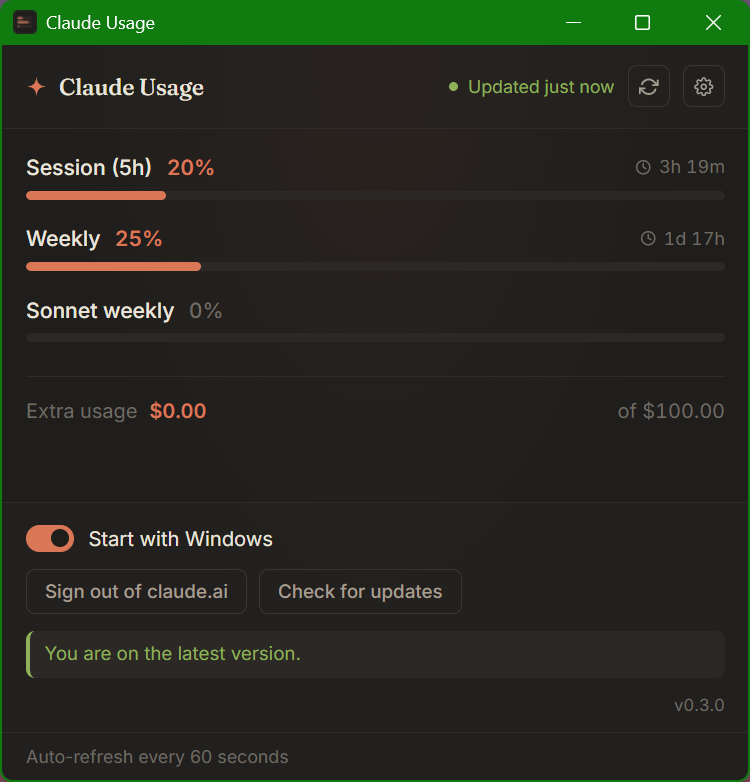

# Claude Usage

A small Windows desktop widget that shows your live **Claude.ai quota** — Session (5h), Weekly, Sonnet/Opus weekly, and any extra-usage balance — auto-refreshing every 60 seconds in the system tray.

[](https://github.com/HanChangHun/claude-usage/releases/latest)
[](https://hanchanghun.github.io/claude-usage/)



---

## ⬇️ Install (Windows)

Download the latest **MSI** from [Releases](https://github.com/HanChangHun/claude-usage/releases/latest), double-click, and you're done.

> Windows SmartScreen will warn about an unknown publisher (the binary isn't code-signed). Click **More info → Run anyway** to install.

After installing once, **future versions update themselves** — the in-app updater fetches signed releases from GitHub and applies them on the next launch (no more MSI re-installs).

## ✨ What it does

- A 440×420 main window with a clean dark widget showing all four limits + reset countdowns + extra-usage balance.
- A **system tray icon** so you can park it out of the way; left-click to show the window, right-click for menu.
- **Settings panel** (gear icon, top right):
  - Toggle **Start with Windows** — registers the app to launch with the OS, sitting in the tray.
  - **Sign out of claude.ai** — clears the in-app session and re-prompts for login.
  - **Check for updates** — manual trigger; otherwise checked automatically on startup.

## 🔧 How it works

Claude.ai has an internal endpoint that powers its own sidebar quota widget:

```
GET https://claude.ai/api/organizations/<org_id>/usage
```

Only a logged-in browser tab on `claude.ai` can call it (same-origin + session cookie). The desktop app embeds a **hidden WebView2 window** pointed at claude.ai (this is also where you sign in once). A Rust loop in the app:

1. Reads cookies from the embedded webview every 60 seconds (`Webview::cookies_for_url`).
2. Extracts the `lastActiveOrg` cookie value.
3. Calls the `/usage` endpoint with `reqwest`, attaching all session cookies.
4. Emits a Tauri event with the JSON response.
5. The main window subscribes and re-renders the widget.

If the cookies expire or the user signs out, the app surfaces the embedded webview so you can sign in again.

**Auto-updates** are signed Ed25519 releases from this repo's GitHub Releases. The app verifies signatures against an embedded public key before applying any binary. Private signing key never leaves the maintainer's machine.

**Stack**: Tauri 2 + Rust + WebView2 (system) + a tiny vanilla-JS frontend. Final MSI is ~5 MB; runtime memory ~50 MB.

## 🌐 Web fallback (no install)

A static, install-free version is also hosted at <https://hanchanghun.github.io/claude-usage/>. It's a fun mini variant: paste a one-line snippet into the claude.ai DevTools console and a separate site tab renders the same widget, refreshing every 60 s while the claude.ai tab stays open.

Useful when:
- You're on someone else's computer and can't install
- macOS / Linux user (the desktop build is Windows-only for now)
- Just want to peek without setup

For everyday use, the desktop app wins on every axis (no console paste, no second tab to babysit, autostart, tray icon, auto-update).

## 🔒 Privacy

- Your claude.ai session cookie stays inside the embedded webview (same trust boundary as a normal browser tab on claude.ai).
- The only network request the app makes is the same `/api/organizations/<org>/usage` call claude.ai makes for itself.
- The auto-updater talks to GitHub Releases and downloads signed MSI binaries; nothing else.
- No analytics, no telemetry, no third-party services.

## 🛠 Building from source

```bash
git clone https://github.com/HanChangHun/claude-usage
cd claude-usage/app
npm install
npm run tauri dev          # dev mode
npm run tauri build        # release MSI in src-tauri/target/release/bundle/msi/
```

Requires Rust 1.95+, Node 20+, Visual Studio Build Tools 2022 with the **Desktop development with C++** workload.

To produce a release that the auto-updater can verify, set the signing key env vars before `tauri build`:

```powershell
$env:TAURI_SIGNING_PRIVATE_KEY = (Get-Content $HOME\.tauri\claude-usage-app.key -Raw)
$env:TAURI_SIGNING_PRIVATE_KEY_PASSWORD = "<your password>"
npm run tauri build
```

A `.msi.sig` file is generated alongside the MSI; both go into the GitHub release with a `latest.json` manifest pointing at the MSI.

## 📁 Layout

```
claude-usage/
├── index.html, style              # static landing page (web fallback lives here too)
├── assets/                        # icons + screenshot
├── app/                           # Tauri desktop app
│   ├── src/                       # frontend (HTML/CSS/JS) — runs in WebView2
│   └── src-tauri/                 # Rust + tauri.conf.json + capabilities
└── LICENSE
```

## 📝 License

MIT © 2026 Han Changhun
