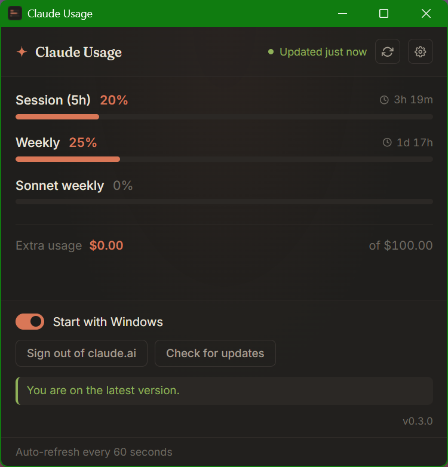

# Claude Usage

[English](../README.md) | [한국어](README.ko.md) | [简体中文](README.zh-CN.md)

<div align="center">


[](https://www.microsoft.com/windows)
[](https://tauri.app)
[](https://www.rust-lang.org)
[](../LICENSE)
[](https://github.com/HanChangHun/claude-usage/releases/latest)
[](https://github.com/HanChangHun/claude-usage/releases)

**실시간 Claude.ai 사용량 — Windows 데스크톱에 고정.**

이 위젯이 사용량 확인 몇 번을 덜어줬다면, GitHub 스타 하나가 다른 Claude 사용자들이 발견하는 데 도움이 됩니다.

[기능](#-기능) • [설치](#-설치-windows) • [동작 원리](#-동작-원리) • [개인정보](#-개인정보--보안) • [빌드](#-소스에서-빌드)

</div>

---



## ✨ 기능

### 🎯 핵심

- **📊 실시간 사용량 표시** — claude.ai가 알려주는 모든 한도를 한눈에: 세션(5시간), 전체 모델 주간, 모델별 주간 한도(Opus, Sonnet, Fable 등 — 새 모델도 자동으로 표시). 추가 사용량 잔량 포함.
- **⏱️ 60초 자동 새로고침** — 백그라운드 루프가 매분 사용량을 폴링하고, 각 한도 옆에 리셋 카운트다운을 표시합니다.
- **🪟 440×420 컴팩트 윈도우** — 데스크톱을 차지하지 않는 깔끔한 다크 위젯.
- **🎯 시스템 트레이** — 좌클릭으로 윈도우, 우클릭으로 메뉴. 창을 닫으면 종료되지 않고 트레이로 숨어요.
- **📦 가벼운 사이즈** — MSI ~5 MB, 런타임 메모리 ~50 MB.

### ⚙️ 설정 패널

오른쪽 상단 톱니바퀴 아이콘:

- **🚀 Windows 시작 시 실행** — 자동 시작 토글; 로그인 후 트레이에 조용히 자리잡습니다.
- **🔓 claude.ai 로그아웃** — 임베디드 웹뷰 세션을 비우고 다시 로그인 화면을 띄웁니다.
- **🔄 업데이트 확인** — 수동 트리거; 평소엔 시작 시 자동으로 체크합니다.
- **☕ Ko-fi 후원** — 이 위젯이 시간을 아껴줬다면 [커피 한 잔](https://ko-fi.com/edgetpu)이 유지보수에 힘이 됩니다.

### 🛡️ 안전한 자동 업데이트

- **🔐 Ed25519 서명 검증** — 모든 업데이트는 임베디드 공개 키로 서명을 검증한 뒤에야 설치됩니다. 개인 키는 메인테이너 머신을 떠나지 않아요.
- **📥 GitHub Releases만** — 업데이터는 단 하나의 엔드포인트만 사용합니다.
- **🎯 무중단 설치** — 첫 MSI 설치 이후 새 버전은 다음 실행 시 자동 적용 — 재설치 없음.

---

## ⬇️ 설치 (Windows)

1. [Releases](https://github.com/HanChangHun/claude-usage/releases/latest)에서 최신 **MSI** 다운로드.
2. 더블클릭 → **추가 정보 → 실행**을 누르세요 (코드 사이닝 안 된 바이너리라 Windows SmartScreen이 경고합니다).
3. 끝. 트레이에 위젯이 뜨고, 처음 한 번 claude.ai에 로그인하면 됩니다.

> 이 한 번의 설치 이후, 모든 새 릴리스는 인앱 업데이터로 자동 적용됩니다.

---

## 🔧 동작 원리

Claude.ai 내부에는 자체 사이드바 위젯이 쓰는 사용량 엔드포인트가 있습니다:

```
GET https://claude.ai/api/organizations/<org_id>/usage
```

이 엔드포인트는 `claude.ai`에 로그인된 브라우저 탭에서만 호출 가능합니다 (same-origin + 세션 쿠키 필요). 데스크톱 앱은 claude.ai를 가리키는 **숨겨진 WebView2 윈도우**를 임베드합니다 — 처음 로그인도 여기서 일어나죠. 앱 안의 Rust 루프가:

1. 60초마다 임베디드 웹뷰에서 쿠키를 읽고 (`Webview::cookies_for_url`),
2. org ID를 결정하고 (`lastActiveOrg` 쿠키 → 마지막으로 유효했던 값 → 쿠키가 없거나 낡았을 땐 same-origin `GET /api/organizations`로 탐색),
3. 모든 세션 쿠키를 붙여 `reqwest`로 `/usage` 엔드포인트를 호출하고,
4. JSON 응답을 Tauri 이벤트로 발행하고,
5. 메인 윈도우가 구독해서 위젯을 다시 렌더링합니다.

세션이 정말 만료되면 (연속 3회 인증 실패 — 일시적 오류나 챌린지 페이지는 세지 않음) 임베디드 웹뷰가 표시돼서 다시 로그인할 수 있습니다. 자동 표시는 최대 6시간에 한 번이며, 그동안에도 위젯에는 항상 로그인 버튼이 보입니다.

**스택**: Tauri 2 + Rust + WebView2 (시스템) + 가벼운 vanilla-JS 프론트엔드.

---

## 🔒 개인정보 & 보안

- 🏠 **로컬에만** — claude.ai 세션 쿠키는 임베디드 웹뷰 안에만 머뭅니다 (claude.ai의 일반 브라우저 탭과 동일한 신뢰 경계).
- 🎯 **Same-Origin 전용** — 앱이 호출하는 API는 claude.ai가 스스로 쓰는 것과 동일한 두 개뿐입니다: `/api/organizations` (쿠키가 없을 때의 org 탐색)와 `/api/organizations/<org>/usage`.
- 🔐 **서명된 업데이트** — 자동 업데이터는 GitHub Releases와만 통신하고, 바이너리 적용 전에 서명을 검증합니다.
- 🚫 **텔레메트리 없음** — 분석, 서드파티 서비스, 추적 일체 없음.
- 📖 **오픈 소스** — 모든 코드 공개; 자유롭게 감사 가능합니다.

---

## 🛠 소스에서 빌드

```bash
git clone https://github.com/HanChangHun/claude-usage
cd claude-usage/app
npm install
npm run tauri dev          # 개발 모드
npm run tauri build        # 릴리스 MSI (src-tauri/target/release/bundle/msi/)
```

Rust 1.95+, Node 20+, Visual Studio Build Tools 2022의 **C++를 사용한 데스크톱 개발** 워크로드가 필요합니다.

### 서명된 릴리스 만들기

```powershell
# 최초 1회 설정
cp app/.env.example app/.env   # app/.env를 열어 키 경로와 비밀번호 입력

# 릴리스 때마다 (버전 범프 후 — CLAUDE.md의 4개 파일 참조)
cd app
.\release.ps1 -Notes "이번 릴리스 변경 사항"
```

`release.ps1`은 `app/.env`(gitignored)를 읽어 `tauri build`를 실행하고, 서명된 MSI + `.msi.sig`를 `app/installers/`에 복사한 뒤 `app/installers/latest.json`까지 자동 생성합니다(서명 포함). MSI, `.msi.sig`, `latest.json` 세 파일을 해당 버전 태그의 GitHub 릴리스에 업로드하세요. 전체 단계는 [CLAUDE.md](../CLAUDE.md#releasing) 참조.

---

## 📝 라이선스

MIT © 2026 Han Changhun

## Codex 주간 한도 추가 기능

**설정 → Show Codex usage**를 켜면 Codex 주간 사용률, 남은 비율, 초기화까지
남은 시간이 나타납니다. 설정은 저장되며, 기능을 끄면 Codex 조회가 멈춥니다.
Claude와 Codex는 각자 연결 상태를 표시하며 60초마다 갱신합니다.

Codex CLI를 설치하고 `codex login`으로 ChatGPT 계정에 로그인해 주세요.
기존 CLI 로그인은 그대로 사용하므로 위젯에서 웹사이트에 다시 로그인하거나
API 키를 입력할 필요가 없습니다. API 키 로그인만으로는 구독 한도를 조회할
수 없습니다. Desktop 로그인은 CLI에서 해당 인증을 사용할 수 있을 때 재사용합니다.
로그인이 만료되면 CLI에서 다시 로그인한 뒤 Codex의 Refresh를 눌러 주세요.

공식 `codex app-server`의 `account/rateLimits/read`를 사용합니다. 모델 작업이나
대화 기록 조회 없이 한도만 읽으며, 무료 한도 초기화 크레딧을 사용하지 않습니다.
표준 npm 설치 경로와 PATH에서 실행 파일을 찾습니다. 별도 설치 경로를 쓰시면
`CODEX_USAGE_CLI` 환경 변수에 네이티브 `codex.exe` 경로를 지정해 주세요.
